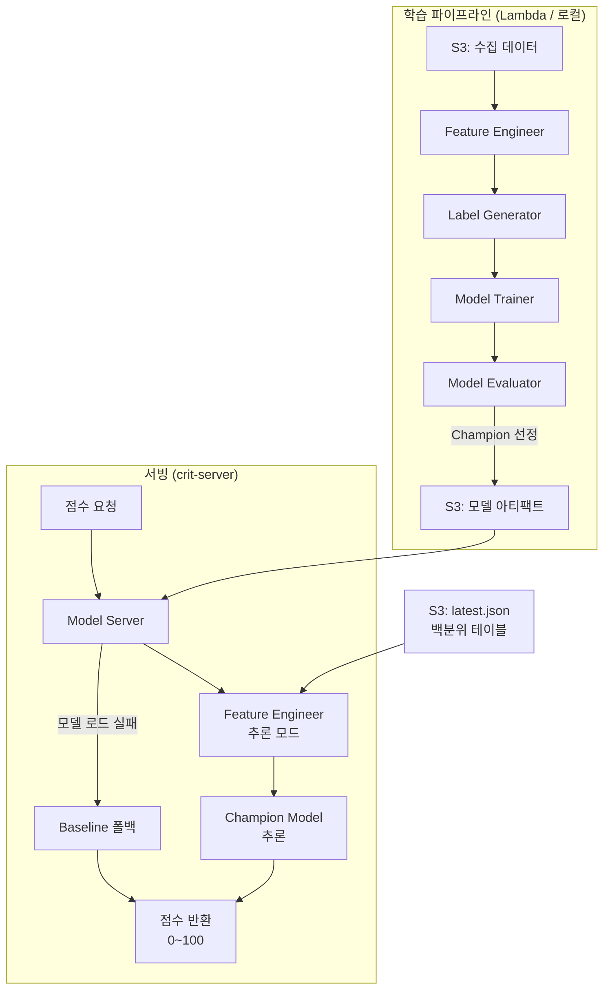
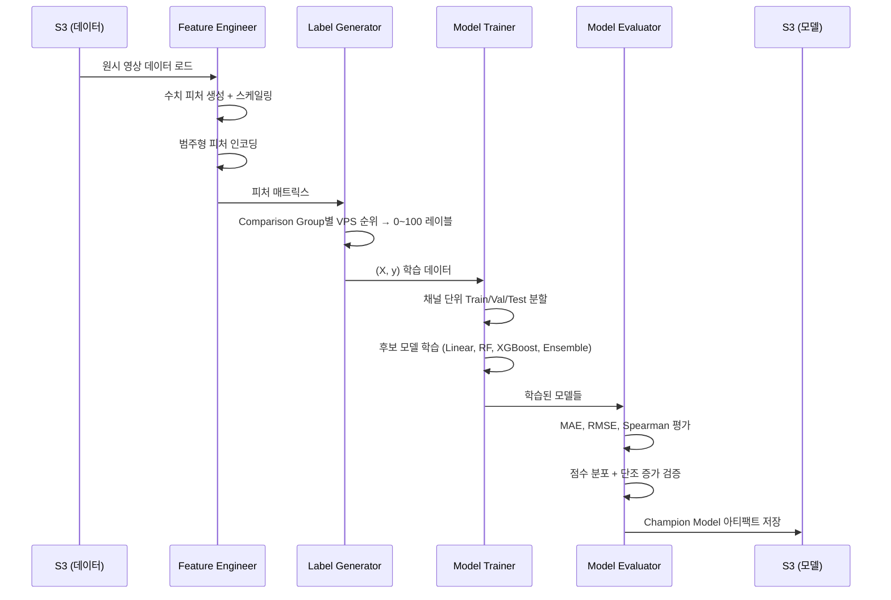
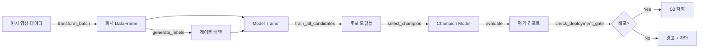

# Design Document: ML Scoring Model

## Overview

기존 수동 가중치 기반 점수 모델(VPS 백분위 × 0.60 + 참여율 백분위 × 0.25 + 좋아요율 백분위 × 0.15)을 ML 기반으로 대체한다. 82,327개 영상 데이터를 활용하여 다양한 ML 모델을 학습·비교하고, 최적의 Champion Model을 선정하여 기존 Lambda → S3 → crit-server 아키텍처 위에서 서빙한다.

### 핵심 목표

1. **데이터 기반 가중치 학습**: 수동 60/25/15 가중치를 데이터에서 학습된 최적 가중치로 대체
2. **비선형 관계 포착**: 트리 기반 모델 및 앙상블을 통해 피처 간 비선형 상호작용 반영
3. **견고성 확보**: 이상치 클리핑, 소규모 그룹 폴백, 교차 검증 안정성 보장
4. **기존 아키텍처 호환**: S3 기반 모델 아티팩트 저장, crit-server에서 200ms 이내 추론

### 설계 범위

- 피처 엔지니어링 파이프라인 (학습/추론 동일 변환 보장)
- 자기지도 레이블 생성 (Comparison Group 내 VPS 순위 기반)
- 모델 학습 및 Champion 선정 (Linear, RF, XGBoost/LightGBM, Ensemble)
- 모델 평가 및 Baseline 비교
- S3 기반 모델 서빙 및 폴백 전략
- 재학습 파이프라인 및 모델 버전 관리

---

## Architecture

### 전체 시스템 아키텍처



### 학습 파이프라인 상세



### 배포 구조

| 컴포넌트 | 위치 | 역할 |
|---|---|---|
| 학습 파이프라인 | Lambda 또는 로컬 | 모델 학습 및 평가 |
| 모델 아티팩트 | S3 `models/` | joblib 직렬화된 모델 + 메타데이터 |
| 백분위 테이블 | S3 `latest.json` | 추론 시 백분위 피처 계산용 |
| 추론 서버 | crit-server (Spring Boot) | 모델 로드 + 점수 계산 |

---

## Components and Interfaces

### 1. Feature Engineer (`feature_engineer.py`)

피처 생성 및 변환을 담당하는 모듈. 학습과 추론에서 동일한 변환을 보장한다.

```python
class FeatureEngineer:
    """학습/추론 공통 피처 변환 파이프라인."""

    def __init__(self, percentile_tables: dict, scaler_params: dict = None):
        """
        Args:
            percentile_tables: S3 latest.json의 tables 딕셔너리
            scaler_params: 학습 시 fit된 스케일러 파라미터 (추론 시 로드)
        """

    def transform(self, video_data: dict) -> np.ndarray:
        """단일 영상 → 피처 벡터 변환 (추론용)."""

    def transform_batch(self, videos: list[dict]) -> pd.DataFrame:
        """영상 리스트 → 피처 DataFrame 변환 (학습용)."""

    def fit_scalers(self, videos: list[dict]) -> dict:
        """학습 데이터로 스케일러 파라미터 fit. 저장용 dict 반환."""

    def clip_outliers(self, features: pd.DataFrame, group_key: str) -> pd.DataFrame:
        """Comparison Group 내 상위/하위 1% 클리핑."""
```

**피처 목록:**

| 피처명 | 타입 | 변환 | 설명 |
|---|---|---|---|
| `vps_raw` | 수치 | log1p | Views Per Subscriber 원시값 |
| `vps_percentile` | 수치 | 없음 (0~1) | 그룹 내 VPS 백분위 |
| `engagement_rate_raw` | 수치 | log1p | 참여율 원시값 |
| `engagement_percentile` | 수치 | 없음 (0~1) | 그룹 내 참여율 백분위 |
| `like_rate_raw` | 수치 | log1p | 좋아요율 원시값 |
| `like_rate_percentile` | 수치 | 없음 (0~1) | 그룹 내 좋아요율 백분위 |
| `duration_sec` | 수치 | log1p | 영상 길이 (초) |
| `days_since_upload` | 수치 | log1p | 업로드 후 경과일 |
| `subscriber_count` | 수치 | log1p | 채널 구독자 수 |
| `sub_tier` | 범주형 | One-Hot | 구독자 구간 (S/M/L/XL) |
| `is_short` | 범주형 | Binary | 숏폼 여부 (0/1) |
| `category_id` | 범주형 | One-Hot | 카테고리 (12개) |

### 2. Label Generator (`label_generator.py`)

학습 레이블을 자동 생성하는 모듈.

```python
class LabelGenerator:
    """Comparison Group 내 VPS 순위 기반 레이블 생성."""

    def generate_labels(self, videos: list[dict]) -> np.ndarray:
        """
        각 Comparison Group 내에서 VPS 순위를 산출하고,
        percent_rank * 100으로 0~100 연속 점수 변환.
        """

    def validate_distribution(self, labels: np.ndarray) -> dict:
        """
        레이블 분포 검증.
        Returns: {"is_uniform": bool, "concentration_warning": str | None}
        """
```

### 3. Model Trainer (`model_trainer.py`)

모델 학습 및 Champion 선정을 담당.

```python
class ModelTrainer:
    """다중 모델 학습 및 Champion 선정."""

    def __init__(self, config: TrainingConfig):
        """config: 학습 설정 (분할 비율, 최소 샘플 수 등)."""

    def split_data(self, X, y, channel_ids) -> tuple:
        """채널 단위 Train(70%)/Val(15%)/Test(15%) 분할."""

    def train_all_candidates(self, X_train, y_train, X_val, y_val) -> dict:
        """
        후보 모델 전부 학습:
        - LinearRegression (Ridge)
        - RandomForestRegressor
        - XGBRegressor / LGBMRegressor
        - StackingRegressor / WeightedAverage Ensemble
        Returns: {model_name: trained_model}
        """

    def select_champion(self, models: dict, X_val, y_val) -> str:
        """검증 세트 기준 최고 성능 모델 선정. Returns: champion_name."""

    def retrain_champion(self, champion_name: str, X_train, y_train) -> object:
        """Champion 아키텍처로만 재학습."""
```

### 4. Model Evaluator (`model_evaluator.py`)

모델 성능 평가 및 Baseline 비교.

```python
class ModelEvaluator:
    """모델 평가 및 배포 게이트."""

    def evaluate(self, model, X_test, y_test) -> dict:
        """
        Returns: {
            "mae": float, "rmse": float, "spearman": float,
            "score_distribution": dict, "monotonic_check": bool
        }
        """

    def compare_with_baseline(self, model_metrics: dict, baseline_metrics: dict) -> dict:
        """
        Baseline 대비 개선 여부 판단.
        Returns: {"improved": bool, "comparison_report": dict}
        """

    def check_deployment_gate(self, model_metrics: dict, baseline_metrics: dict) -> bool:
        """Spearman이 Baseline보다 낮으면 False (배포 차단)."""
```

### 5. Model Server (`model_server.py`)

추론 서빙 모듈. crit-server에서 호출.

```python
class ModelServer:
    """모델 로드 및 추론."""

    def __init__(self, s3_bucket: str, model_key: str):
        """S3에서 모델 아티팩트 로드."""

    def predict(self, video_data: dict) -> float:
        """
        단일 영상 점수 추론.
        Returns: 0~100 범위의 점수 (float).
        실패 시 Baseline 폴백.
        """

    def _baseline_fallback(self, video_data: dict) -> float:
        """수동 가중치(60/25/15) 기반 점수 계산."""
```

### 6. Training Pipeline (`training_pipeline.py`)

재학습 오케스트레이션.

```python
class TrainingPipeline:
    """재학습 파이프라인 오케스트레이터."""

    def __init__(self, config: PipelineConfig):
        """config: S3 경로, Champion 정보, 성능 이력 등."""

    def run_retrain(self, new_data_key: str) -> dict:
        """
        Champion Model 재학습 실행.
        Returns: {"success": bool, "deployed": bool, "metrics": dict}
        """

    def check_degradation(self) -> bool:
        """3회 연속 성능 하락 여부 확인."""

    def recommend_reselection(self) -> str:
        """전체 모델 재선정 권고 메시지."""
```

### 인터페이스 간 데이터 흐름



---

## Data Models

### 모델 아티팩트 구조 (S3)

```
pj-kmucd1-08-s3-data-collector/
├── latest.json                    ← 백분위 테이블 (기존)
├── models/
│   ├── champion_meta.json         ← Champion 모델 메타데이터
│   ├── champion_model.joblib      ← 직렬화된 모델
│   ├── scaler_params.json         ← 피처 스케일러 파라미터
│   ├── feature_config.json        ← 피처 목록 및 변환 설정
│   └── versions/
│       ├── v1_20260501.joblib     ← 버전 이력
│       ├── v1_20260501_meta.json
│       ├── v2_20260508.joblib
│       └── v2_20260508_meta.json
├── training/
│   ├── selection_report.json      ← 초기 모델 선정 리포트
│   └── retrain_history.json       ← 재학습 이력
```

### champion_meta.json

```json
{
  "model_name": "xgboost",
  "version": "v2",
  "trained_at": "2026-05-08T10:30:00+00:00",
  "training_data": {
    "total_videos": 82327,
    "total_channels": 1309,
    "groups_used": 48,
    "min_group_size": 20
  },
  "hyperparameters": {
    "n_estimators": 500,
    "max_depth": 6,
    "learning_rate": 0.05,
    "subsample": 0.8,
    "colsample_bytree": 0.8
  },
  "metrics": {
    "mae": 8.2,
    "rmse": 11.5,
    "spearman": 0.91,
    "baseline_spearman": 0.85
  },
  "feature_importance": {
    "vps_percentile": 0.35,
    "engagement_percentile": 0.18,
    "like_rate_percentile": 0.12,
    "duration_sec": 0.08,
    "days_since_upload": 0.07,
    "subscriber_count": 0.06,
    "is_short": 0.05,
    "category_id_20": 0.03
  }
}
```

### scaler_params.json

```json
{
  "fitted_at": "2026-05-08T10:30:00+00:00",
  "scalers": {
    "vps_raw": {"type": "log1p", "clip_min": 0.0, "clip_max": 500.0},
    "engagement_rate_raw": {"type": "log1p", "clip_min": 0.0, "clip_max": 1.0},
    "like_rate_raw": {"type": "log1p", "clip_min": 0.0, "clip_max": 1.0},
    "duration_sec": {"type": "log1p", "clip_min": 1, "clip_max": 86400},
    "days_since_upload": {"type": "log1p", "clip_min": 1, "clip_max": 3650},
    "subscriber_count": {"type": "log1p", "clip_min": 0, "clip_max": 100000000}
  }
}
```

### feature_config.json

```json
{
  "version": "1.0",
  "numeric_features": [
    "vps_raw", "vps_percentile",
    "engagement_rate_raw", "engagement_percentile",
    "like_rate_raw", "like_rate_percentile",
    "duration_sec", "days_since_upload", "subscriber_count"
  ],
  "categorical_features": {
    "sub_tier": ["S", "M", "L", "XL"],
    "is_short": [0, 1],
    "category_id": ["1", "2", "10", "15", "17", "20", "22", "23", "24", "25", "26", "28"]
  },
  "total_feature_dim": 27
}
```

### selection_report.json

```json
{
  "selected_at": "2026-05-08T10:30:00+00:00",
  "candidates": {
    "ridge_regression": {"mae": 10.5, "rmse": 14.2, "spearman": 0.85},
    "random_forest": {"mae": 9.1, "rmse": 12.8, "spearman": 0.88},
    "xgboost": {"mae": 8.2, "rmse": 11.5, "spearman": 0.91},
    "lightgbm": {"mae": 8.4, "rmse": 11.7, "spearman": 0.90},
    "stacking_ensemble": {"mae": 8.0, "rmse": 11.2, "spearman": 0.92}
  },
  "champion": "stacking_ensemble",
  "selection_criteria": "spearman",
  "baseline_metrics": {"mae": 12.0, "rmse": 16.5, "spearman": 0.82}
}
```

### retrain_history.json

```json
{
  "history": [
    {
      "version": "v1",
      "trained_at": "2026-05-01T10:00:00+00:00",
      "metrics": {"mae": 8.5, "rmse": 12.0, "spearman": 0.90},
      "deployed": true
    },
    {
      "version": "v2",
      "trained_at": "2026-05-08T10:30:00+00:00",
      "metrics": {"mae": 8.2, "rmse": 11.5, "spearman": 0.91},
      "deployed": true
    }
  ],
  "consecutive_degradations": 0,
  "reselection_recommended": false
}
```

### 추론 요청/응답 인터페이스

**요청 (crit-server → Model Server):**

```json
{
  "video_id": "abc123",
  "view_count": 150000,
  "like_count": 8500,
  "comment_count": 320,
  "subscriber_count": 250000,
  "duration_sec": 480,
  "category_id": "20",
  "is_short": false,
  "published_at": "2026-04-28T12:00:00Z"
}
```

**응답:**

```json
{
  "video_id": "abc123",
  "score": 72.4,
  "model_version": "v2",
  "comparison_group": "L_0_20",
  "percentiles": {
    "vps": 0.78,
    "engagement": 0.65,
    "like_rate": 0.71
  },
  "fallback_used": false
}
```

---


## Correctness Properties

*A property is a characteristic or behavior that should hold true across all valid executions of a system—essentially, a formal statement about what the system should do. Properties serve as the bridge between human-readable specifications and machine-verifiable correctness guarantees.*

### Property 1: 피처 완전성 (Feature Completeness)

*For any* 유효한 영상 데이터(조회수 > 0, 구독자 > 0)와 유효한 백분위 테이블이 주어졌을 때, Feature Engineer의 transform 결과는 반드시 모든 필수 피처(vps_raw, vps_percentile, engagement_rate_raw, engagement_percentile, like_rate_raw, like_rate_percentile, duration_sec, days_since_upload, subscriber_count, sub_tier one-hot, is_short, category_id one-hot)를 포함하며, 총 피처 차원이 feature_config.json에 정의된 total_feature_dim과 일치해야 한다.

**Validates: Requirements 1.1, 1.2, 1.3**

### Property 2: 수치 변환 단조 증가 (Numeric Transform Monotonicity)

*For any* 두 양수 값 a, b에 대해 a < b이면, log1p(a) < log1p(b)이다. 즉, log1p 변환은 수치 피처의 상대적 순서를 보존한다.

**Validates: Requirements 1.4**

### Property 3: 피처 변환 일관성 (Feature Transform Consistency)

*For any* 유효한 영상 데이터에 대해, transform(single_video)의 결과와 transform_batch([single_video])에서 해당 행의 결과가 수치적으로 동일해야 한다. 또한 동일 입력에 대해 transform을 반복 호출하면 항상 동일한 결과를 반환해야 한다.

**Validates: Requirements 1.5**

### Property 4: 레이블 범위 및 순서 보존 (Label Range and Order Preservation)

*For any* Comparison Group 내 영상 집합(크기 ≥ 2)에 대해, 생성된 레이블은 모두 [0, 100] 범위에 있으며, VPS가 더 높은 영상의 레이블은 VPS가 더 낮은 영상의 레이블보다 크거나 같아야 한다.

**Validates: Requirements 2.1, 2.3**

### Property 5: Champion 선정 최적성 (Champion Selection Optimality)

*For any* 후보 모델별 평가 메트릭(Spearman) 딕셔너리에 대해, select_champion이 반환하는 모델의 Spearman 값은 모든 다른 후보의 Spearman 값보다 크거나 같아야 한다.

**Validates: Requirements 3.3**

### Property 6: 채널 단위 분할 불변량 (Channel-Level Split Invariant)

*For any* 채널-영상 매핑에 대해, split_data 수행 후 어떤 채널도 두 개 이상의 분할(train/val/test)에 동시에 존재하지 않아야 한다.

**Validates: Requirements 3.4**

### Property 7: 최소 샘플 필터링 (Minimum Sample Filtering)

*For any* Comparison Group별 영상 집합에 대해, 학습에 포함된 모든 그룹의 샘플 수는 20개 이상이어야 한다.

**Validates: Requirements 3.5**

### Property 8: 모델 메타데이터 직렬화 Round-Trip

*For any* 유효한 모델 메타데이터(하이퍼파라미터, 메트릭, Champion 정보)에 대해, JSON으로 직렬화한 후 역직렬화하면 원본과 동일한 데이터가 복원되어야 한다.

**Validates: Requirements 3.6**

### Property 9: 단조 증가 검증 정확성 (Monotonicity Check Correctness)

*For any* (점수, VPS) 쌍의 리스트에 대해, 점수 구간별(0~20, 20~40, 40~60, 60~80, 80~100) 평균 VPS가 실제로 단조 증가하면 검증 함수는 True를, 아니면 False를 반환해야 한다.

**Validates: Requirements 4.4**

### Property 10: 배포 게이트 정확성 (Deployment Gate Correctness)

*For any* 두 Spearman 값 (new_spearman, baseline_spearman)에 대해, new_spearman < baseline_spearman이면 배포를 차단(False)하고, new_spearman ≥ baseline_spearman이면 배포를 허용(True)해야 한다.

**Validates: Requirements 4.5, 6.2**

### Property 11: 점수 출력 범위 불변량 (Score Output Range Invariant)

*For any* 유효한 영상 입력 데이터에 대해, predict 함수의 출력은 항상 [0, 100] 범위 내에 있어야 한다. 모델의 원시 예측값이 범위를 벗어나더라도 클리핑되어야 한다.

**Validates: Requirements 5.2, 7.2**

### Property 12: 백분위 계산 단조 증가 (Percentile Lookup Monotonicity)

*For any* 정렬된 백분위 배열과 두 값 a, b에 대해 a < b이면, 계산된 백분위(a) ≤ 백분위(b)이어야 한다. 또한 결과는 항상 [0, 1] 범위에 있어야 한다.

**Validates: Requirements 5.3**

### Property 13: 연속 하락 감지 정확성 (Consecutive Degradation Detection)

*For any* 성능 이력 리스트(길이 ≥ 3)에 대해, 마지막 3개 항목의 메트릭이 연속으로 감소하면 check_degradation은 True를, 아니면 False를 반환해야 한다.

**Validates: Requirements 6.5**

### Property 14: 이상치 클리핑 범위 보장 (Outlier Clipping Range Guarantee)

*For any* 수치 값과 해당 Comparison Group의 [1%, 99%] 경계에 대해, clip_outliers 적용 후 결과는 항상 [하한, 상한] 범위 내에 있어야 한다.

**Validates: Requirements 7.1**

### Property 15: 소규모 그룹 폴백 (Small Group Fallback)

*For any* Comparison Group에 대해, 해당 그룹의 샘플 수가 20개 미만이면 상위 그룹(구독자 구간만 다른 그룹)의 모델이 사용되어야 한다.

**Validates: Requirements 7.3**

### Property 16: 교차 검증 안정성 검증 (Cross-Validation Stability Check)

*For any* 5개의 fold별 MAE 값에 대해, max(MAE) - min(MAE) > mean(MAE) × 0.20이면 안정성 검증은 실패(False)를, 아니면 성공(True)을 반환해야 한다.

**Validates: Requirements 7.4**

### Property 17: 그룹 독립성 (Group Independence)

*For any* 기존 그룹 데이터 집합에 새로운 그룹 데이터를 추가했을 때, 기존 그룹에 속한 영상들의 점수는 추가 전후로 변하지 않아야 한다.

**Validates: Requirements 7.5**

---

## Error Handling

### 피처 엔지니어링 오류

| 오류 상황 | 처리 방식 |
|---|---|
| 백분위 테이블에 해당 그룹 없음 | 상위 그룹으로 폴백 (Req 7.3) |
| 입력 값이 음수 또는 NaN | 0으로 대체 후 로그 기록 |
| 구독자 수 0 (VPS 계산 불가) | 해당 영상 제외, 경고 로그 |
| 백분위 테이블 로드 실패 | 캐시된 이전 테이블 사용, 없으면 에러 전파 |

### 모델 학습 오류

| 오류 상황 | 처리 방식 |
|---|---|
| 학습 데이터 부족 (전체 < 1000개) | 학습 중단, 에러 리포트 생성 |
| 특정 후보 모델 학습 실패 | 해당 모델 제외, 나머지로 Champion 선정 |
| 모든 모델이 Baseline보다 낮음 | 경고 출력, Baseline 유지, 원인 분석 리포트 |
| 메모리 부족 (OOM) | 배치 크기 축소 후 재시도 |

### 모델 서빙 오류

| 오류 상황 | 처리 방식 |
|---|---|
| 모델 아티팩트 로드 실패 | Baseline 폴백 (Req 5.5) |
| 추론 시간 200ms 초과 | 타임아웃 후 Baseline 폴백 |
| 입력 데이터 형식 오류 | 400 에러 반환, 상세 메시지 포함 |
| S3 접근 불가 | 로컬 캐시 사용, 없으면 Baseline 폴백 |

### 재학습 파이프라인 오류

| 오류 상황 | 처리 방식 |
|---|---|
| 재학습 중 예외 발생 | 기존 모델 유지, 오류 로그 기록 (Req 6.4) |
| 새 모델 성능 하락 | 배포 차단, 기존 모델 유지 |
| 3회 연속 성능 하락 | 전체 재선정 권고 알림 (Req 6.5) |
| 데이터 병합 충돌 | 최신 데이터 우선, 충돌 로그 기록 |

---

## Testing Strategy

### 테스트 프레임워크

- **단위 테스트**: `pytest` (Python 표준 테스트 프레임워크)
- **Property-Based Testing**: `hypothesis` (Python PBT 라이브러리)
- **통합 테스트**: `pytest` + `moto` (AWS 서비스 모킹)

### Property-Based Tests (Hypothesis)

각 Correctness Property에 대해 하나의 property-based test를 작성한다.

**설정:**
- 최소 100회 반복 (`@settings(max_examples=100)`)
- 각 테스트에 설계 문서 Property 참조 태그 포함
- 태그 형식: `# Feature: ml-scoring-model, Property {N}: {title}`

**테스트 파일 구조:**

```
tests/
├── test_feature_engineer_props.py    ← Property 1, 2, 3, 14
├── test_label_generator_props.py     ← Property 4
├── test_model_trainer_props.py       ← Property 5, 6, 7, 8
├── test_model_evaluator_props.py     ← Property 9, 10, 16
├── test_model_server_props.py        ← Property 11, 12
├── test_pipeline_props.py            ← Property 13, 15, 17
├── test_feature_engineer_unit.py     ← Example/Edge case tests
├── test_label_generator_unit.py      ← Example tests (2.2)
├── test_model_trainer_unit.py        ← Example tests (3.2)
├── test_model_server_unit.py         ← Example tests (5.5)
├── test_pipeline_unit.py             ← Example tests (6.4)
└── test_integration.py               ← Integration tests (3.1, 4.1, 4.2, 5.1, 5.4, 6.1, 6.3)
```

### Unit Tests (Example-Based)

| 테스트 대상 | 검증 내용 | 관련 요구사항 |
|---|---|---|
| 레이블 분포 경고 | 80% 집중 시 경고 발생 | 2.2 |
| MLP 포함 조건 | deep_learning=True 시 MLP 추가 | 3.2 |
| 점수 분포 검증 | 정규분포 vs 편향 분포 판별 | 4.3 |
| Baseline 폴백 | 모델 로드 실패 시 폴백 동작 | 5.5 |
| 재학습 에러 핸들링 | 예외 시 기존 모델 유지 | 6.4 |

### Integration Tests

| 테스트 대상 | 검증 내용 | 관련 요구사항 |
|---|---|---|
| 전체 학습 파이프라인 | 소규모 데이터로 end-to-end 학습 | 3.1 |
| 메트릭 계산 | 알려진 값에 대한 MAE/RMSE/Spearman | 4.1, 4.2 |
| S3 모델 저장/로드 | moto로 S3 모킹 후 round-trip | 5.1 |
| 추론 성능 | 200ms 이내 완료 벤치마크 | 5.4 |
| 재학습 트리거 | 새 데이터 이벤트 시 Champion만 학습 | 6.1 |
| 버전 롤백 | 이전 버전 복원 가능 여부 | 6.3 |

### 테스트 실행

```bash
# 전체 테스트
pytest tests/ -v

# Property-based tests만
pytest tests/test_*_props.py -v

# 통합 테스트만
pytest tests/test_integration.py -v

# 커버리지 리포트
pytest tests/ --cov=src --cov-report=html
```

---

## References

| 출처 | 용도 | 링크 |
|---|---|---|
| scikit-learn (Ridge, RandomForest, StackingRegressor) | 선형 회귀, Random Forest, 앙상블 학습 | https://scikit-learn.org/stable/ |
| XGBoost | Gradient Boosting 모델 학습 | https://xgboost.readthedocs.io/ |
| LightGBM | Gradient Boosting 대안 모델 | https://lightgbm.readthedocs.io/ |
| Hypothesis | Python Property-Based Testing 라이브러리 | https://hypothesis.readthedocs.io/ |
| joblib | 모델 직렬화/역직렬화 | https://joblib.readthedocs.io/ |
| scipy.stats.spearmanr | Spearman 순위 상관계수 계산 | https://docs.scipy.org/doc/scipy/reference/generated/scipy.stats.spearmanr.html |
| moto | AWS 서비스 모킹 (테스트용) | https://github.com/getmoto/moto |
| pandas | 데이터 처리 및 피처 엔지니어링 | https://pandas.pydata.org/ |
| numpy | 수치 연산 | https://numpy.org/ |
| Winsorization (통계 기법) | 이상치 처리 — 상위/하위 백분위 경계로 클리핑 | Tukey, J.W. (1977). Exploratory Data Analysis |
| Stacking Ensemble | 메타 학습기를 통한 모델 결합 기법 | Wolpert, D.H. (1992). Stacked Generalization |
| GroupKFold (scikit-learn) | 채널 단위 교차 검증 분할 | https://scikit-learn.org/stable/modules/generated/sklearn.model_selection.GroupKFold.html |

